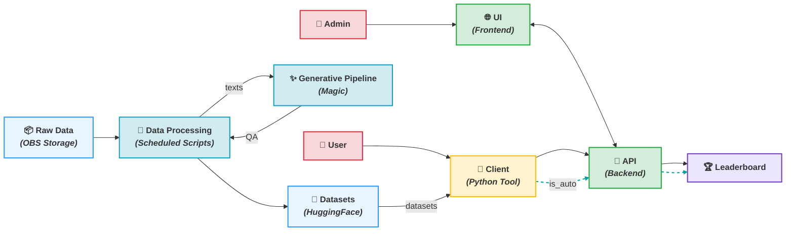

# Dynamic RAG On News benchmark (DRAGON)

```mermaid
flowchart LR
    %% Node Definitions
    OBS["📦 Raw Data<br><i>(OBS Storage)</i>"]
    DP["🔄 Data Processing<br><i>(Scheduled Scripts)</i>"]
    HF["🤗 Datasets<br><i>(HuggingFace)</i>"]
    GP["✨ Generative Pipeline<br><i>(Magic)</i>"]

    Client["🐍 Client<br><i>(Python Tool)</i>"]
    FE["🌐 UI<br><i>(Frontend)</i>"]
    API["🚀 API<br><i>(Backend)</i>"]

    User["👤 User"]
    Admin["🔧 Admin"]

    LB["🏆 Leaderboard"]

    %% Data Flow
    OBS --> DP
    DP --> HF
    DP -- texts --> GP
    GP -- QA --> DP

    %% User and Admin Interactions
    User --> Client
    Admin --> FE
    FE <--> API
    API --> LB
    API -.-> LB

    Client --> API
    Client -. is_auto .-> API
    HF -->|datasets| Client

    linkStyle 8 stroke:#00a0a0,stroke-width:2px,stroke-dasharray: 5,5
    linkStyle 10 stroke:#00a0a0,stroke-width:2px,stroke-dasharray: 5,5

    %% Styling
    classDef storage fill:#e8f4ff,stroke:#3399ff,stroke-width:2px,color:#333,font-weight:bold
    classDef processing fill:#d1ecf1,stroke:#17a2b8,stroke-width:2px,color:#333,font-weight:bold
    classDef ui fill:#d4edda,stroke:#28a745,stroke-width:2px,color:#333,font-weight:bold
    classDef client fill:#fff3cd,stroke:#ffc107,stroke-width:2px,color:#333,font-weight:bold
    classDef admin fill:#f8d7da,stroke:#dc3545,stroke-width:2px,color:#333,font-weight:bold
    classDef leaderboard fill:#ece5ff,stroke:#6f42c1,stroke-width:2px,color:#333,font-weight:bold

    %% Apply styles
    class OBS,HF storage
    class DP,GP processing
    class FE,API ui
    class Client client
    class User,Admin admin
    class LB leaderboard

```