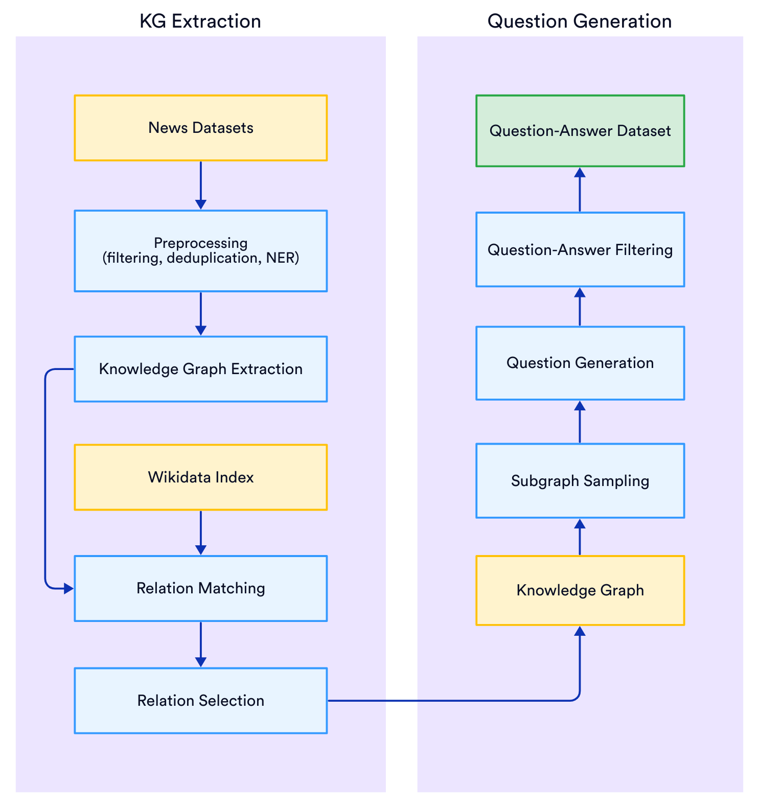

# Dynamic RAG On News benchmark (DRAGON)

  

## Architecture

The benchmark is designed to evaluate retrieval-augmented generation (RAG) systems in a realistic way, dynamically evolving news domain. It's architecture prioritizes modularity, automation, and reproducibility while addressing the core challenges in the RAG evaluation landscape.

The whole pipeline of the benchmark architecture can be explored in the following diagram:

    

### Client library

The client library, located in `lib/`, provides tools to benchmark RAG pipelines.

//TBD

### QA dataset generation pipeline

    

The Data Generation pipeline consists of 2 stages: KG Extraction and Question Generation. The KG Extraction retrieves factual information from texts and preserves the most specific and fresh facts in form of a Knowledge Graph. The Question Generation module samples subgraphs of a certain structure to generate a question-answer pair with LLM.
