# Dynamic RAG On News benchmark (DRAGON)

```mermaid
flowchart LR
    %% Node Definitions
    OBS["📦 Raw Data<br><i>(OBS Storage)</i>"]
    DP["🔄 Data Processing<br><i>(Scheduled Scripts)</i>"]
    HF["🤗 Datasets<br><i>(HuggingFace)</i>"]
    GP["✨ Generative Pipeline<br><i>(Magic)</i>"]

    Client["🐍 Client<br><i>(Python Tool)</i>"]
    FE["🌐 UI<br><i>(Frontend)</i>"]
    API["🚀 API<br><i>(Backend)</i>"]

    User["👤 User"]
    Admin["🔧 Admin"]

    LB["🏆 Leaderboard"]

    %% Data Flow
    OBS --> DP
    DP --> HF
    DP -- texts --> GP
    GP -- QA --> DP

    %% User and Admin Interactions
    User --> Client
    Admin --> FE
    FE <--> API
    API --> LB
    API -.-> LB

    Client --> API
    Client -. is_auto .-> API
    HF -->|datasets| Client

    linkStyle 8 stroke:#00a0a0,stroke-width:2px,stroke-dasharray: 5,5
    linkStyle 10 stroke:#00a0a0,stroke-width:2px,stroke-dasharray: 5,5

    %% Styling
    classDef storage fill:#e8f4ff,stroke:#3399ff,stroke-width:2px,color:#333,font-weight:bold
    classDef processing fill:#d1ecf1,stroke:#17a2b8,stroke-width:2px,color:#333,font-weight:bold
    classDef ui fill:#d4edda,stroke:#28a745,stroke-width:2px,color:#333,font-weight:bold
    classDef client fill:#fff3cd,stroke:#ffc107,stroke-width:2px,color:#333,font-weight:bold
    classDef admin fill:#f8d7da,stroke:#dc3545,stroke-width:2px,color:#333,font-weight:bold
    classDef leaderboard fill:#ece5ff,stroke:#6f42c1,stroke-width:2px,color:#333,font-weight:bold

    %% Apply styles
    class OBS,HF storage
    class DP,GP processing
    class FE,API ui
    class Client client
    class User,Admin admin
    class LB leaderboard

```



### Client library

The client library, located in `lib/`, provides tools to benchmark RAG pipelines. It allows users to:

1.  **Load Datasets**: Easily fetch text and question datasets from HuggingFace using functions in `rag_bench.data`. It ensures version consistency between datasets.
    ```python
    from rag_bench.data import get_datasets

    texts_ds, questions_ds, version = get_datasets()
    ```

2.  **Build a RAG Pipeline**: The `rag_bench.baseline` module offers a reference implementation for a RAG pipeline.
    *   Initialize a retriever (e.g., ChromaDB with MMR search) from your text data and an embedding model:
        ```python
        from rag_bench.baseline import init_retriever
        # Assuming `embedding_model` is defined (e.g., OpenAIEmbeddings)
        # and `texts_ds` is loaded as shown above.
        retriever = init_retriever(texts_ds, embedding_model)
        ```
    *   Initialize a generation chain using the retriever, a language model, and an optional prompt:
        ```python
        from rag_bench.baseline import init_generation
        # Assuming `llm` is a compatible language model (e.g., ChatOpenAI)
        generation_chain = init_generation(retriever, llm)
        ```

3.  **Generate Results**: Use the configured pipeline to process questions from the dataset.
    ```python
    from rag_bench.baseline import get_results

    # Assuming `questions_ds` is loaded
    results = get_results(generation_chain, questions_ds)
    # `results` will be a dictionary mapping question IDs to responses and retrieved contexts.
    ```

4.  **Evaluate Performance**: The `rag_bench.evaluator` module helps assess the RAG pipeline's effectiveness.
    *   It calculates retrieval metrics like Hit Rate and MRR.
    *   It computes generation metrics such as ROUGE scores, Exact Match, and Substring Match.
    ```python
    from rag_bench.evaluator import evaluate_rag_results, RAGEvaluationResults

    # Assuming `results` from get_results and `questions_ds` are available
    evaluation_output = evaluate_rag_results(results, questions_ds)

    # Print a summary table of average metrics
    evaluation_output.to_table()

    # Access detailed individual results or average metrics
    # individual_evals = evaluation_output.individual_results
    # average_metrics = evaluation_output.average_metrics
    ```

Key modules are:
*   `rag_bench.data`: For dataset loading.
*   `rag_bench.baseline`: For RAG pipeline construction and execution.
*   `rag_bench.evaluator`: For evaluating the pipeline's output.
*   `rag_bench.constants`: Stores repository IDs for datasets.
*   `rag_bench.helper`: Utility functions.


### QA dataset generation pipeline


The Data Generation pipeline consists of 2 stages: KG Extraction and Question Generation. The KG Extraction retrieves factual information from texts and preserves the most specific and fresh facts in form of a Knowledge Graph. The Question Generation module samples subgraphs of a certain structure to generate a question-answer pair with LLM.